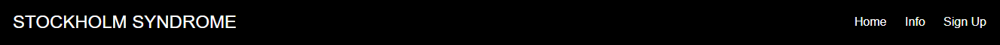
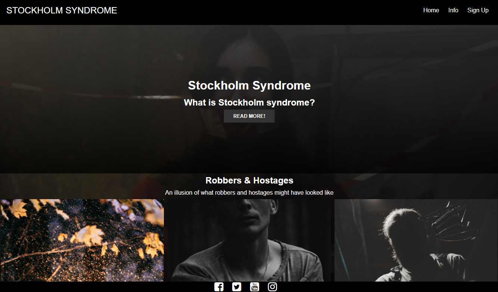
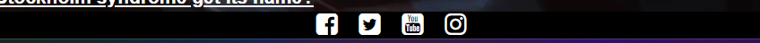
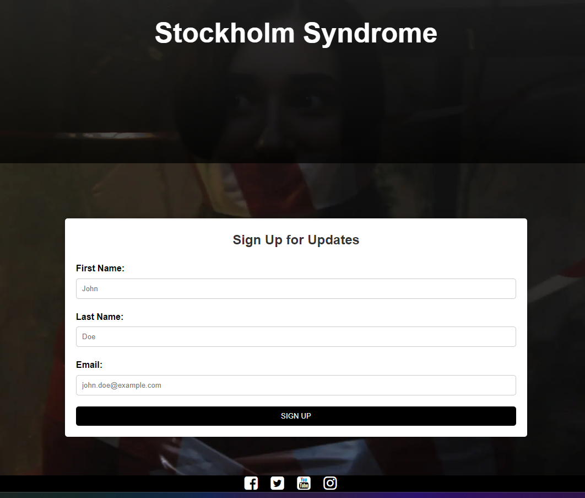
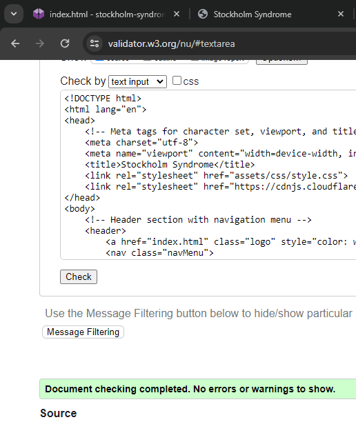

# The Stockholm Syndrome Website

## Overview
**Welcome Screen**: Introduces and provides an overview.

Welcome to the **Stockholm Syndrome Website**, a dedicated platform aimed at providing valuable insights into the psychological phenomenon commonly referred to as Stockholm syndrome. This README offers a comprehensive overview of the website's functionalities, deployment process, and a recognition of the contributions made by various individuals and sources.

## Key Features

### User-Friendly Navigation Bar

Our website boasts a responsive navigation bar, skillfully adapted from W3Schools, which remains accessible on all pages. This feature guarantees a seamless and intuitive browsing experience. It offers convenient links to essential sections:

- **Home**: The landing page for the website.
- **Stockholm Syndrome Info**: In-depth knowledge about Stockholm syndrome.
- **Contact**: A dedicated page for user inquiries.

### Captivating Hero Section

The hero section takes center stage with a captivating image and a concise overview of Stockholm syndrome. It serves as an attention-grabbing introduction to the topic.

### Information Cards

Information cards delve into the key characters involved in Stockholm syndrome situations, such as robbers, hostages, and police. Each card includes:

- **Title**: A succinct label describing the character.
- **Description**: A brief explanation of the character's role in Stockholm syndrome cases.
- **"Read more" Button**: Users can click this button to access detailed character profiles.

### Engaging Footer

Our footer offers links to our organization's social media profiles, ensuring users can stay updated on news and developments related to Stockholm syndrome.

### Sign-Up Form

Users can subscribe to receive updates and newsletters about Stockholm syndrome. This feature allows users to customize their information preferences while collecting user names and email addresses for communication purposes.

### Rigorous Testing

We have subjected our website to comprehensive testing to ensure a smooth and consistent user experience. This includes:

- **HTML**: Our website passes the official W3C validator with no errors.
- **CSS**: It also successfully passes the official (Jigsaw) validator, free from errors.

    

## Deployment Process

Our website is hosted on GitHub Pages, with deployment accomplished through the following steps:

1. Within the GitHub repository, access the **Settings** tab.
2. From the source section drop-down menu, select the **Master Branch**.
3. Once the master branch is selected, the page will automatically refresh, signifying a successful deployment.

You can explore the live site by clicking on the following links:

- [Stockholm Syndrome Website](https://example.com/stockholm-syndrome)
- [Norrmalmstorg Robbery](https://example.com/norrmalmstorg-robbery)
- [Understanding Stockholm Syndrome: Symptoms, Causes, and Treatment](https://example.com/stockholm-syndrome-treatment)

## Credits

### Content

- The content for the Home page has been adapted from a Wikipedia article on Stockholm syndrome.
- Guidance on implementing form validation on the Sign-Up page was drawn from a specific YouTube tutorial.
- Icons featured in the footer are sourced from Font Awesome.

### Media

- The images used on the home and sign-up pages are credited to the following talented photographers on Unsplash:

  - James Kovin [@james2k](https://unsplash.com/@james2k)
  - Kenny Eliason [@neonbrand](https://unsplash.com/@neonbrand)
  - Maxim-Hopman [@nampoh](https://unsplash.com/@nampoh)
  - Harrison Haines [Harrison Haines](https://www.pexels.com/sv-se/@harrisonhaines)
  - Vladimir Uporov [Vladimir Uporov](https://www.pexels.com/@uporovphoto)
  - Zachary Debottis [Zachary Debottis](https://www.pexels.com/@zachtheshooter)

  - [Pexels](https://www.pexels.com/)
